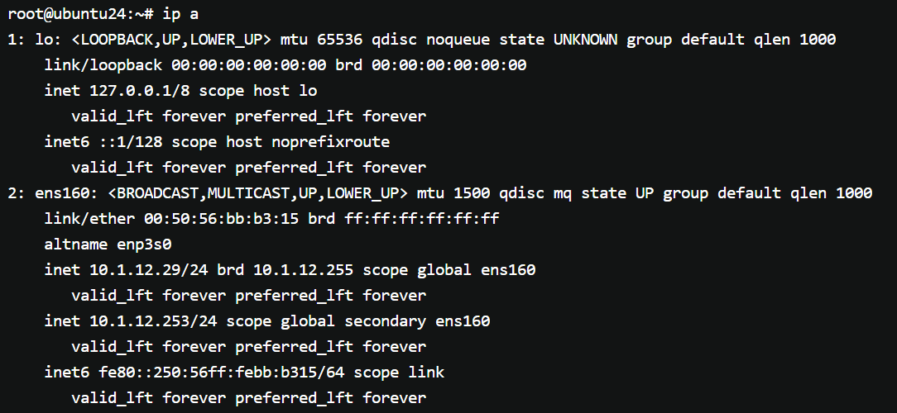

# 一阶段培训总结报告（Report.md）

## 一、学习内容总结

### 1. 客户成功与组织认知 3.30

- 了解公司整体业务及组织架构
- 明确客户成功岗位职责及工作场景
- 熟悉公司价值体现：Fast Software 理念

------

### 2. JumpServer 产品学习 3.30

围绕 JumpServer 功能进行了解并简单实操  
同时完成：
- 单节点堡垒机环境搭建
- 官方文档的阅读

------

### 3. 文档与工具链能力 3.31

#### Markdown 语言的学习

- 掌握Markdown基本语法

#### Git工具基础命令学习 

- git clone / add / commit / push
- 分支创建与切换（main / dev）
- 基础协作流程理解（PR / Merge）

------

### 4. 一阶段功能实操 4.1

#### 熟悉 JumpServer 功能场景：
- 资产纳管、权限分配、会话审计、命令控制等核心功能
- 了解远程应用发布机

#### 了解各组件的工作内容

| 组件 | 本质    | 功能                   |
| ---- |-------|----------------------|
|Core组件| jumpserver核心控制器 | JumpServer 的核心，负责认证、授权、审计及提供RESTful API，是系统运行的基础。 |
|koko组件| SSH代理+命令审计| 服务于类 Unix 资产，通过SSH/Telnet提供字符型连接，管理SSH会话生命周期 |
|lion组件| 浏览器RDP代理 | 支持Web端访问Windows资产，实现浏览器直接操作Windows服务器 |
|XRDP组件|       | 通过JumpServer Client支持访问 Windows 2000、XP 等老版本系统资产。 |
|Razor组件|       | JumpServer Client 默认使用的 RDP 组件，通过拉起本地原生RDP客户端进行访问。 |
|Magnus组件|       | 提供数据库代理访问能力，支持客户端工具直连数据库资产。|
|Chen组件|       | 支持通过 Web GUI 方式访问和管理数据库资产。 |
|Celery组件| 后台异步任务| 处理异步任务，如自动化运维任务调度与执行。|  

------
 
### 5. jumpserver主备架构搭建 4.2-4.3

- 阅读jumpserver主备架构搭建和客户交付文档
- PostgreSQL 主库故障 VIP 漂移实验模拟

**实验环境**: JumpServer 数据库高可用架构  
**涉及节点**:
- Master (10.1.12.78) - 原主库
- Slave (10.1.12.29) - 原从库

#### 1. 实验目标

验证 Keepalived + PostgreSQL 主从架构在主库故障时的自动切换能力，包括：
- VIP 自动漂移
- 从库自动提升为主库
- 故障恢复流程

#### 2. 架构回顾

| 组件 | 配置 | VIP            |
|:---|:---|:---------------|
| PostgreSQL | 主从复制 | 10.1.12.253/24 |
| Keepalived | vrrp_instance VI_1 | 虚拟路由 ID 51     |
| 检查脚本 | check.sh (5432, 6379) | 10秒间隔，3次失败切换   |
| 切换脚本 | promoter.sh | 自动执行 promote   |

#### 3. 故障模拟过程
使用命令systemctl stop postgresql模拟数据库故障，观察VIP从主机漂移到从机上。并且原主库su - postgres -c "psql -c \"SELECT pg_is_in_recovery();\""返回t，原从库返回f。

------
### 二. 遇到的问题
#### 问题1：
<html> <head><title>502 Bad Gateway</title></head> <body> 
<h1>502 Bad Gateway</h1>
 

nginx
 </body> </html> <!-- a padding to disable MSIE and Chrome friendly error page --> <!-- a padding to disable MSIE and Chrome friendly error page --> <!-- a padding to disable MSIE and Chrome friendly error page --> <!-- a padding to disable MSIE and Chrome friendly error page --> <!-- a padding to disable MSIE and Chrome friendly error page --> <!-- a padding to disable MSIE and Chrome friendly error page -->
排错思路：  

    1. 查看错误日志cat /data/jumpserver/core/data/logs/jumpserver.log
> root@yangx-virtual-machine:/opt/jumpserver-ee-v4.10.16-x86_64# cat /data/jumpserver/core/data/logs/jumpserver.log
2026-04-02 09:26:38 [ERRO] pid 87 thread <Thread(debouncer_3, started daemon 136858586572480)> delay run update_user_last_used error: connection to server at "postgresql" (192.168.250.8), port 5432 failed: No route to host

> 问题定位显示JumpServer无法访问内置 PostgreSQL 容器  

    2. 检查服务状态，执行命令jmsctl status确认组件运行状态
    3. 执行命令 jmsctl restart postgresql 尝试重启服务

#### 问题2

用户更新导入失败，报错显示error:not found（尝试创建用户 成功）  
经过多次修改表格尝试后，定位到问题所在：对创建/更新的逻辑有误。创建用户不需要填写ID而更新用户是在旧用户的基础上进行更新，需要具体系统生成的ID。

#### 问题3
虚拟机连接堡垒机报错显示：IP端口可达，Ansible执行虚拟机管理信息脚本异常：java.net.UnknownHostException: ansible: Try again,可能导致堡垒机无法连接，是否仍然尝试连接？

## 三、阶段成果

- 完成 JumpServer 单节点部署实践
- 学习 Markdown 技术文档编写
- 掌握 Git 基础使用流程
