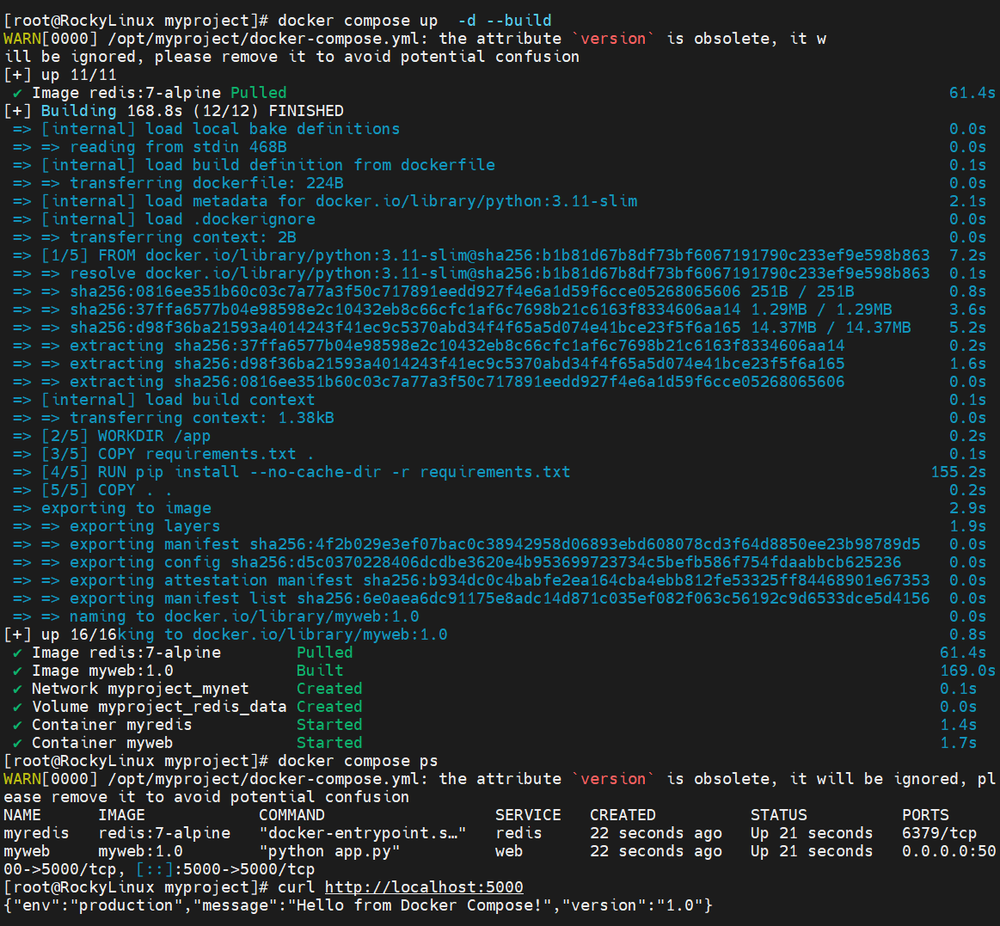

# 二阶段培训总结报告（Report.md）

## 一、学习内容总结

### 1. jumpserver主备架构深入学习 4.7
在上周主备架构搭建基础上继续完成对jumpserver的安装  
**遇到问题**  
**问题1：**
在上传安装包时由于jumpserver安装包过大，无法通过jumpserver自带的文件传输功能上传至内网虚拟机上  
**参数认知**：jumpserver的文件传输功能只能上传小于200MB的文件  
**解决方法**：
1. 通过阿里云OSS上传文件
2. 使用wget方法直接下载

### 2. 了解常见的运维工具原理 4.8-4.9 
### 1. docker
  
**安装过程**

```bash
# 安装 Docker
systemctl start docker
systemctl enable docker

# 验证状态
systemctl status docker
```
**遇到的问题**

|问题|原因| 解决               |
|----|---|------------------|
|拉取镜像超时|国内服务器无法连接docker hub| 配置国内镜像仓库         |
|3306端口冲突|宿主机已运行MySQL导致冲突| 改映射 -p 3307:3306|

```镜像加速配置 bash
cat > /etc/docker/daemon.json << 'EOF'
{
  "registry-mirrors": [
    "https://docker.m.daocloud.io",
    "https://docker.1panel.live"
  ]
}
EOF

systemctl restart docker
```

**尝试使用docker compose部署项目**  
涉及文件docker_compose.yml、dockerfile、requirements.txt、app.py
```python
#app.py
from flask import Flask
import os
app = Flask(__name__)

@app.route('/')
def hello():
    return {
        'message': 'Hello from Docker Compose!',
        'version': '1.0',
        'env': os.getenv('APP_ENV', 'unknown')
    }

@app.route('/health')
def health():
    return {'status': 'ok'}
if __name__ == '__main__':
    app.run(host='0.0.0.0', port=5000)
```
```text
#dockerfile
FROM python:3.11-slim
WORKDIR /app
COPY requirements.txt .
RUN pip install --no-cache-dir -r requirements.txt
COPY . .
ENV APP_ENV=production
EXPOSE 5000
CMD ["python", "app.py"]
```
```yaml
#docker_compose.yml
version: '3.8'
services:
  web:
    build: .                    # 使用当前目录 Dockerfile 构建
    image: myweb:1.0            # 构建后的镜像名
    container_name: myweb       # 容器名
    ports:
      - "5000:5000"             # 宿主机:容器
    environment:
      - APP_ENV=production
    volumes:
      - ./logs:/app/logs        # 日志持久化
    restart: unless-stopped
    networks:
      - mynet
  redis:
    image: redis:7-alpine       # 直接拉取官方镜像
    container_name: myredis
    volumes:
      - redis_data:/data
    networks:
      - mynet
volumes:
  redis_data:

networks:
  mynet:
    driver: bridge
```
效果展示

### 2. redis
`关键认知：Redis的单线程原子操作指的是服务端处理单个命令时不会被其他命令打断。原子操作是不可分割的最小执行单元，确保并发环境下数据一致性，避免"中间状态"导致的数据污染。`

**数据类型**
1. String字符串  
本质：key→值

| 常用命令               | 意义         |
|--------------------|------------|
| SET key value      | 设置/添加      |
| GET key            | 获取/查看      |
| DEL key            | 删除         |
| INCR key           | 自增（必须是数字）  |
| DECR key           | 自减         |
| SETEX key 60 value | 设置+过期时间（秒） |
应用场景：数据缓存、计数器、token/session
2. Hash哈希  
本质：key→对象  

|常用命令|意义|
|-------|----|
|HSET user:1 name "Tom"|设置对象值|
|HSET user:1 age 15|设置对象值|
|HGET user:1 name|获取对象值|
|HGETALL user:1|获取对象所有信息|
|HDEL user:1 age|删除对象值|
|HDEL user:1|删除对象|

应用场景：用户信息、配置对象  
3. List列表  
本质：有序可重复的字符串列表

|常用命令|意义|
|-------|----|
|LPUSH list a b c|左边插入|
|RPUSH list x y z|右边插入|
|LPOP list |左边弹出|
|RPOP list |右边弹出|
|LRANGE list 0 -1|查看全部|

应用场景：消息队列、栈LIFO、队列FIFO
4. Set集合  

本质：无序+不重复

| 常用命令                          | 意义          |
|-------------------------------|-------------|
| SADD key member member member | 向一个集合添加多个成员 |
| SMEMBERS key                  | 返回集合中的所有成员  |                     
| SREM key member               | 移除集合中的某一成员  |
| SISMEMBER key member          | 判断成员是否在集合中  |

应用场景：去重（用户ID）、标签系统、共同好友（交集）

5. Sorted Set（ZSet）带排序的集合

本质：Set+分数（score）排序

| 常用命令                       | 意义                                   |
|----------------------------|--------------------------------------|
| ZADD key sorce member      | 向有序集合添加一个或多个成员，或更新<br/>已存在成员的分数      |
| ZRANGE key 0 -1 WITHSCORES | 按分数从小到大返回指定区间内的成员 WITHSCORES表示同时返回分数 |
| ZREVRANGE key 0 10         | 按分数从大到小返回指定区间内的成员（降序）                |
| ZREM key member            | 移除有序集合中的一个或多个成员                      |
| ZINCRBY key score member   | 给指定的用户加分                             |


应用场景：排行榜、热度排序、延迟队列

> TYPE key 查看键类型

> SCAN cursor [MATCH pattern] [COUNT count] [TYPE type]分批次查询结果

> FLUSHDB 删除当前数据库的数据 FLUSHALL 删除所有数据库的数据

**监控命令**  
redis-cli -a redispwd --statu 查看redis运行状态
> [root@RockyLinux redis]# redis-cli -a redispwd --stat  
Warning: Using a password with '-a' or '-u' option on the command line interface may not be safe.  
------- data ------ --------------------- load -------------------- - child -  
keys       mem      clients blocked requests            connections  
57         880.46K  2       0       314 (+0)            1012  
57         880.46K  2       0       315 (+1)            1013  
57         880.46K  2       0       316 (+1)            1014  

> redis-cli -a redispwd monitor 交互式阻塞状态，记录数据操作命令  

> redis-cli -a redispwd info 监控系统通过info获取信息  

**动态更新密码**  
> config get requirepass 获取密码  
> config set requirepass redispwd 临时修改密码  
> config rewrite 写入配置文件  

**多用户管理**
> 查看redis的相关连接数  
> info clients  查看当前连接数  
> config get maxclients 查看允许最大连接数  

> ACL CAT 查看所有用户权限  

> ACL SETUSER user1 on >123456 ~* +@all 创建用户  
> 字段含义：user1-用户名 on-启用用户 >123456-设置密码 ~*-允许访问所有key +@all-允许所有命令  

**慢日志**  
问题：redis查询慢，如何排查问题？ ①系统资源使用情况 ②查看慢日志情况
1. 查看慢日志的默认配置  
> CONFIG GET slow*  查看慢日志配置  
> SLOWLOG get 5 获取5条慢日志（默认10条）  
> SLOWLOG len 查看慢日志条数  
> SLOWLOG reset 清空慢日志  

**key的有效期**  
> -1表示永久 -2表示被redis回收了  
> ttl key 查看key的有效期  
> expire key 20 设置key的有效期为20S  
> set key value EX 20 创建key时设置有效期为20S  

**持久化存储**
1. RDB存储：快照还原（默认开启）  
> config get save 查看rdb的默认存储机制配置  
> 127.0.0.1:6379> CONFIG GET save  
> 1) "save"  
> 2) "3600 1 300 100 60 10000"  


2. AOF存储：保存所有命令，还原时重新执行  
> config get append* 查看aof默认存储配置  
> 127.0.0.1:6379> CONFIG GET append*  
> 1) "appendonly"  
> 2) "no"  
> 3) "appendfilename"  
> 4) "appendonly.aof"  
> 5) "appendfsync"  
> 6) "everysec"  


> config set appendonly yes 开启aof持久化配置 aof优先级高于rdb  

*重写机制*
> 手动重写：BGREWRITEAOF  
> 自动重写：CONFIG GET *aof*
> 1) "aof-rewrite-incremental-fsync"  
> 2) "yes"  
> 3) "aof-load-truncated"  
> 4) "yes"  
> 5) "aof-use-rdb-preamble"  
> 6) "yes"  
> 7) "aof_rewrite_cpulist"  
> 8) ""  
> 9) "auto-aof-rewrite-percentage"  
> 10) "100"  
> 11) "auto-aof-rewrite-min-size"  
> 12) "67108864"  
> 13) "replicaof"  
> 14) ""  
> 注意：在业务高峰期如果采用自动触发重写，有可能影响业务；尽可能在业务小的时候运行脚本触发


**RDB工具分析key大小**   
方法一：redis-cli -a redispwd --bigkeys  
方法二：安装rdb工具  pip3 install rdbtools==0.1.15 -i https://mirrors.aliyun.com/pypi/simple/  

       rdb -c memory dump。rdb > 指定文件路径  

**redis主从复制**  
主从复制概念：主服务器用来读取和写入，从服务器仅用于读取，通过读写分离降低服务器压力  
从服务器上的配置文件需要添加：  
slaveof 主服务器IP 端口
masterauth "主服务器密码

**哨兵模式**  
哨兵模式主要实现：  
**监控**：持续检查主从节点是否正常  
**故障自动转移**：主节点宕机，自动选举从节点为新的主节点  
**通知**：向客户端推送变更通知

> **注意**：哨兵节点数量建议 ≥3 且为奇数，避免脑裂问题。`quorum` 一般设为哨兵数的一半以上（如 3 个哨兵设为 2）。  

```conf
# 哨兵端口
port 26379
# 后台运行
daemonize yes
# 工作目录
dir /var/lib/redis/sentinel
# 日志文件
logfile "/var/log/redis/sentinel.log"
# 监控主节点：sentinel monitor <主节点名> <IP> <端口> <quorum>
# quorum: 判定主节点客观下线所需的最小哨兵同意数
sentinel monitor mymaster 192.168.1.101 6379 2
# 主节点密码（如果主从都设置了密码）
sentinel auth-pass mymaster your_redis_password
# 主观下线时间：连续多少毫秒无响应认为节点主观下线（默认30秒）
sentinel down-after-milliseconds mymaster 5000
# 故障转移超时时间（默认3分钟）
sentinel failover-timeout mymaster 60000
# 故障转移时，允许多少个从节点同时同步新主节点数据
# 建议设为1，避免对主节点造成过大压力
sentinel parallel-syncs mymaster 1
```

**redis cluster集群搭建**  
redis cluster采用分布式解决方案
* 数据分片：将 16384 个哈希槽（slot）分配到多个主节点  
* 高可用：每个主节点至少配置 1 个从节点，主节点故障时从节点自动晋升  
* 去中心化：节点间通过 Gossip 协议通信，客户端可直接连接任意节点  

```
# 端口
port 7001
# 绑定IP（生产环境使用真实IP，测试可设 0.0.0.0）
bind 0.0.0.0
# 后台运行
daemonize yes
# 数据目录
dir /usr/local/redis-cluster/7001/data
# PID文件
pidfile /var/run/redis_7001.pid
# 日志文件
logfile "/var/log/redis/redis_7001.log"
# 开启集群模式（核心配置）
cluster-enabled yes
# 集群节点配置文件（自动生成，无需手动编辑）
cluster-config-file nodes-7001.conf
# 节点超时时间（毫秒），超过此时间未通信认为节点故障
cluster-node-timeout 15000
# 如果配置了密码，所有节点密码必须一致
requirepass your_cluster_password
masterauth your_cluster_password
```

### 3. nginx  
Nginx是一款高性能的 **HTTP 服务器**、**反向代理服务器** 及 **电子邮件（IMAP/POP3）代理服务器**。  
**目录结构**  

| 路径   | 作用              |
|----|-----------------|
| /etc/nginx/ | # 主配置目录         |
 ├── nginx.conf | # 主配置文件         |
 ├── conf.d/ | # 额外配置目录        |
 ├── sites-available/ | # 可用站点配置        |
 ├── sites-enabled/ | # 已启用站点配置（软链接）  |
 ├── mime.types | # MIME 类型定义     |
 └── modules/ | # 动态模块目录        |  
| /var/log/nginx/ | # 日志目录          |
 ├── access.log | # 访问日志          |
 └── error.log | # 错误日志          |
| /var/www/html/ | # 默认网站根目录       | 

**静态资源配置**

```python
server {
listen 80;
server_name static.example.com;

    # 网站根目录
    root /var/www/static;
    
    # 默认索引文件
    index index.html index.htm;

    # 缓存静态资源
    location ~* \.(jpg|jpeg|png|gif|ico|css|js)$ {
        expires 30d;
        add_header Cache-Control "public, immutable";
    }

    # 防盗链配置
    location ~* \.(jpg|jpeg|png|gif)$ {
        valid_referers none blocked *.example.com;
        if ($invalid_referer) {
            return 403;
        }
    }
}
```

**动态资源配置**  

```
server {
listen 80;
server_name api.example.com;

    location / {
        # 代理到后端服务
        proxy_pass http://127.0.0.1:8080;
        
        # 转发真实客户端 IP
        proxy_set_header Host $host;
        proxy_set_header X-Real-IP $remote_addr;
        proxy_set_header X-Forwarded-For $proxy_add_x_forwarded_for;
        proxy_set_header X-Forwarded-Proto $scheme;
        
        # 连接超时设置
        proxy_connect_timeout 60s;
        proxy_send_timeout 60s;
        proxy_read_timeout 60s;
    }
}  
```


**负载均衡配置**  

```
# 定义后端服务器组
upstream backend_servers {
# 轮询算法（默认）
server 192.168.1.101:8080 weight=5;
server 192.168.1.102:8080 weight=5;
server 192.168.1.103:8080 backup;  # 备用服务器

    # 健康检查参数
    keepalive 32;
}

server {
listen 80;
server_name app.example.com;

    location / {
        proxy_pass http://backend_servers;
        proxy_set_header Host $host;
        proxy_set_header X-Real-IP $remote_addr;
    }
}  
```

### 4. PostgreSQL  


### 3. 了解PostgreSQL数据库主备原理    

